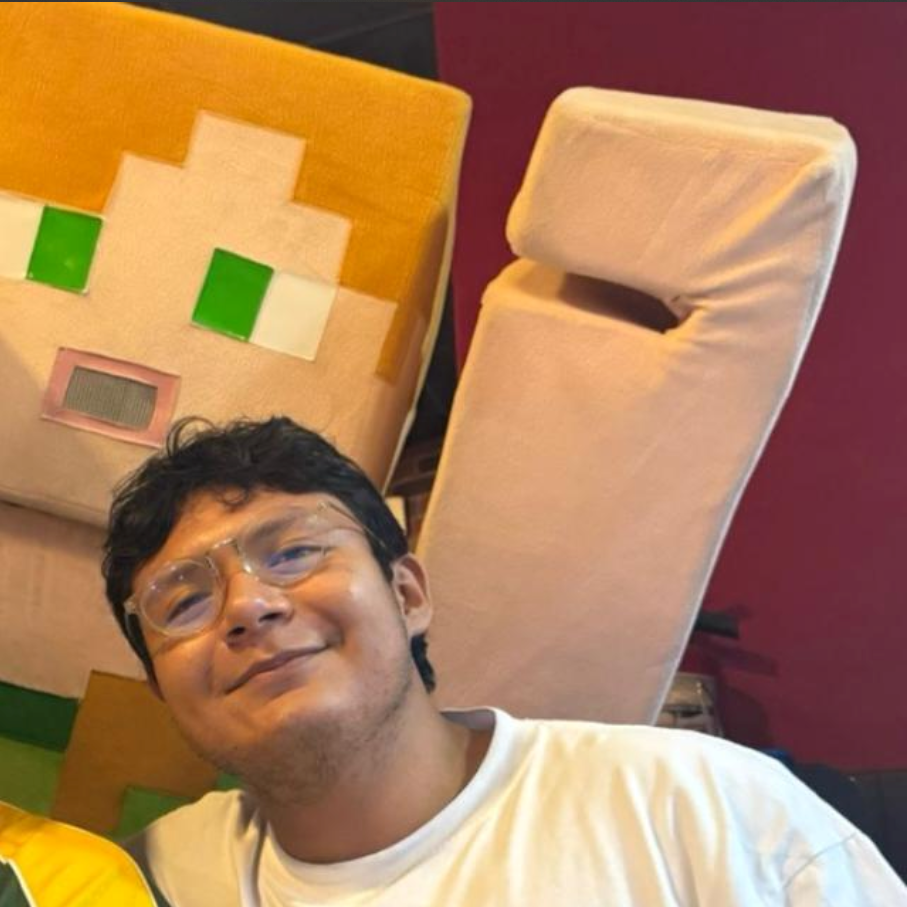

# Arquitectura de Software

## Integrantes

- Edwing Mauricio Molina Chim  
 
- Alejandro Lopéz Maldonado  

- Víctor Saúl Ek May  

## 📱 Demostración del Funcionamiento

A continuación se presentan los videos demostrativos de los tres roles principales de la aplicación:

### 1. 🛡️ Vista Administrador
Gestión y control de la plataforma.
👉 **[Ver demostración en video (Administrador)](https://alumnosuady-my.sharepoint.com/:v:/g/personal/a23216377_alumnos_uady_mx/IQCz7CrpOLBARo0t0CdbzRnmAaLJJgcTIYlPlITl2Ob_8Ho?nav=eyJyZWZlcnJhbEluZm8iOnsicmVmZXJyYWxBcHAiOiJPbmVEcml2ZUZvckJ1c2luZXNzIiwicmVmZXJyYWxBcHBQbGF0Zm9ybSI6IldlYiIsInJlZmVycmFsTW9kZSI6InZpZXciLCJyZWZlcnJhbFZpZXciOiJNeUZpbGVzTGlua0NvcHkifX0&e=4XgnSD)**

### 2. 👤 Vista Cliente
Experiencia de usuario para solicitar servicios.
👉 **[Ver demostración en video (Cliente)](https://alumnosuady-my.sharepoint.com/:v:/g/personal/a23216377_alumnos_uady_mx/IQAXbxUgTd5cTpI-3QTLZtdzARynP_NQzA0uA55fInZrfuI?nav=eyJyZWZlcnJhbEluZm8iOnsicmVmZXJyYWxBcHAiOiJPbmVEcml2ZUZvckJ1c2luZXNzIiwicmVmZXJyYWxBcHBQbGF0Zm9ybSI6IldlYiIsInJlZmVycmFsTW9kZSI6InZpZXciLCJyZWZlcnJhbFZpZXciOiJNeUZpbGVzTGlua0NvcHkifX0&e=AE5Ogp)**

### 3. 👷 Vista Trabajador
Interfaz operativa para el personal.
👉 **[Ver demostración en video (Trabajador)](https://alumnosuady-my.sharepoint.com/:v:/g/personal/a23216377_alumnos_uady_mx/IQB21Qgv_ELrS6IwnHMJ8V1FAfS-u1rGPNX5CGEnWvvbLys?nav=eyJyZWZlcnJhbEluZm8iOnsicmVmZXJyYWxBcHAiOiJPbmVEcml2ZUZvckJ1c2luZXNzIiwicmVmZXJyYWxBcHBQbGF0Zm9ybSI6IldlYiIsInJlZmVycmFsTW9kZSI6InZpZXciLCJyZWZlcnJhbFZpZXciOiJNeUZpbGVzTGlua0NvcHkifX0&e=zG3H62)**